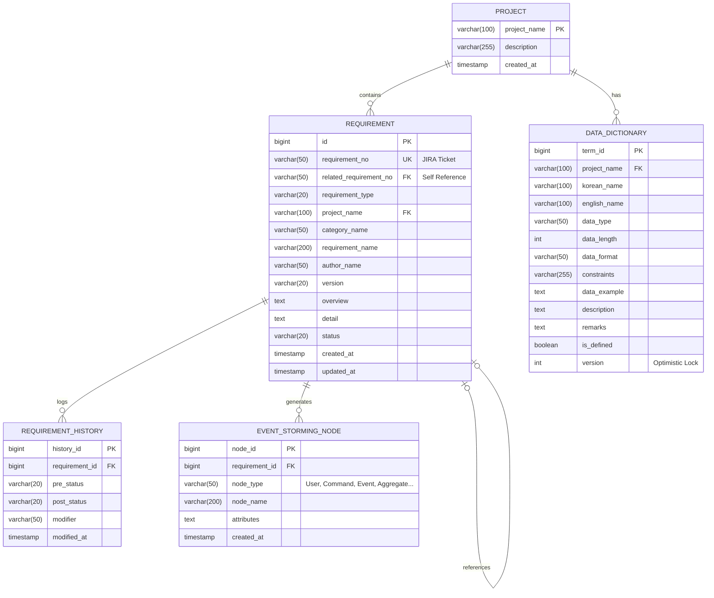

# 데이터 모델

## 1. ERD (Entity Relationship Diagram)

## 2. 엔티티 상세 정의 및 제약조건

### 2.1 PROJECT (프로젝트)
- **PK**: `project_name`
- **설명**: 요구사항 명세 및 데이터 사전이 격리되는 기본 기준 단위.

### 2.2 REQUIREMENT (요구사항)
- **PK**: `id`
- **UK**: `requirement_no` (유일한 JIRA 티켓 번호)
- **FK**: `project_name` -> PROJECT, `related_requirement_no` -> REQUIREMENT.requirement_no
- **Check**: `status` IN ('Draft', 'Clarifying', 'Clarified', 'In Progress', 'Done')
- **Check**: `version` 정규식 `^(\d+)\.(\d+)\.(\d+)$` 만족
- **설명**: 사용자가 등록한 요구사항의 마스터 및 상세 정보 (텍스트/마크다운 텍스트).

### 2.3 REQUIREMENT_HISTORY (요구사항 이력)
- **PK**: `history_id`
- **FK**: `requirement_id` -> REQUIREMENT.id
- **설명**: 요구사항의 상태 변경 이력을 추적.

### 2.4 DATA_DICTIONARY (데이터 사전)
- **PK**: `term_id`
- **UK**: `project_name`, `korean_name` (단일 프로젝트 내 한글 용어명 중복 불가 - 동음이의어의 경우 식별자를 추가하거나 구분자를 두어야 함)
- **FK**: `project_name` -> PROJECT.project_name
- **설명**: NLP 추출 결과 및 사용자 피드백을 통해 갱신되는 프로젝트별 데이터 사전. 낙관적 락(`version`) 사용.

### 2.5 EVENT_STORMING_NODE (이벤트 스토밍 노드)
- **PK**: `node_id`
- **FK**: `requirement_id` -> REQUIREMENT.id
- **설명**: 요구사항 상세 분석 결과 파생된 Event Storming 요소 (Command, Event, Aggregate 등).

## 3. 인덱스 전략

| 테이블명 | 종류 | 인덱스 컬럼 | 목적 |
|---------|---|---|---|
| REQUIREMENT | UK | `requirement_no` | 요구사항 번호를 통한 단건 조회 및 JIRA 티켓명 기반 검색 성능 향상 |
| REQUIREMENT | IX | `project_name`, `category_name` | 프로젝트 및 카테고리별 요구사항 목록 필터링 조회 성능 최적화 |
| REQUIREMENT | IX | `status`, `created_at` | 상태별 최신 요구사항 목록 조회 인덱스 |
| DATA_DICTIONARY| UK | `project_name`, `korean_name` | 프로젝트 내 용어 중복 방지 및 빠른 검색 |
| EVENT_STORMING_NODE | IX | `requirement_id`, `node_type` | 특정 요구사항의 Event Storming 결과 조회 성능 최적화 |

## 4. 데이터 격리 및 파티셔닝 전략
- **격리성 확보 방안**: `DATA_DICTIONARY`와 `REQUIREMENT`의 모든 DB 조회/수정/삭제 쿼리에는 `project_name` (Tenant Key) 조건이 필수적으로 포함되어야 한다.
- **파티셔닝 방안**: `REQUIREMENT_HISTORY` 테이블의 데이터 증가율에 따라 월별 분할 파티셔닝(Range Partitioning)을 고려한다. `REQUIREMENT` 테이블 구조에서 `detail` 은 수 MB 가 될 수 있으므로 TOAST 영역 등을 활용한 LOB 스토리지로 저장된다.
