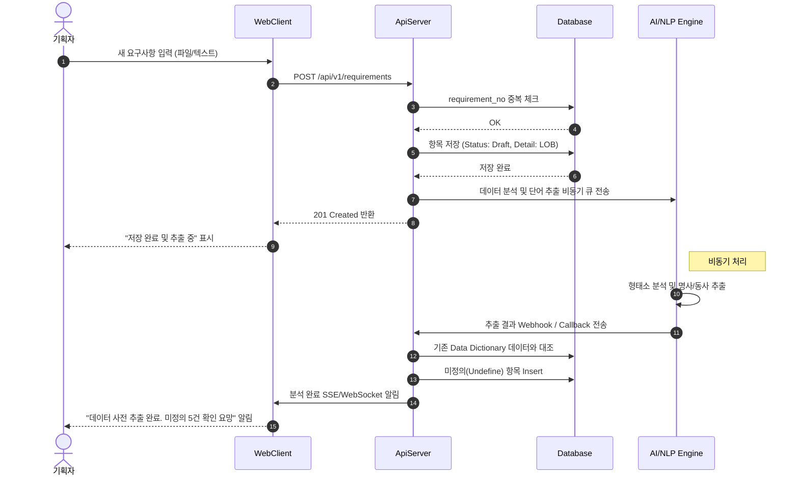
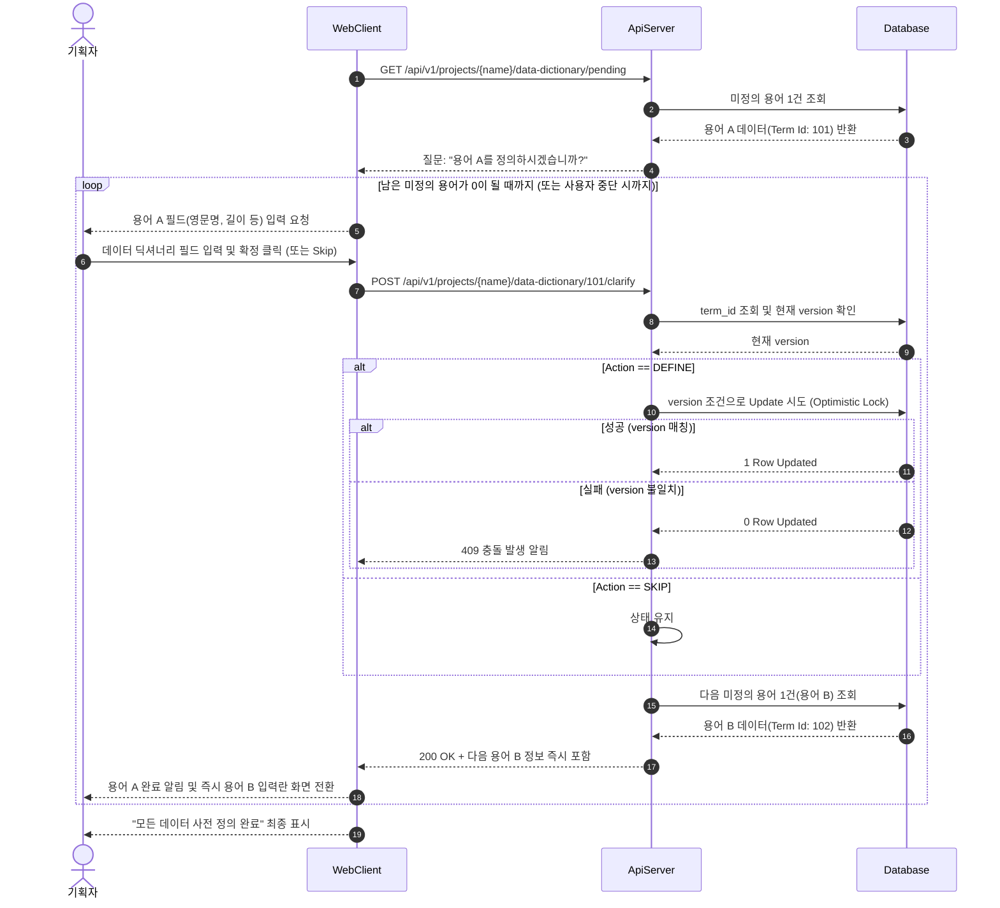
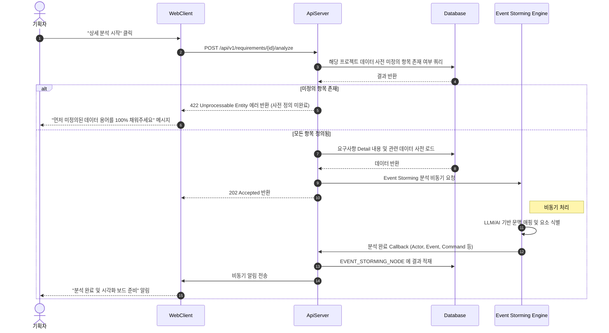

# 시퀀스 다이어그램

## 1. 요구사항 등록 및 데이터 사전 자동 생성 흐름
요구사항이 업로드 된 직후, 비동기 파이프라인을 통해 데이터 사전 단어가 추출되는 과정입니다.

## 2. 데이터 사전 용어 명확화 흐름 (누락 용어 피드백)
기획자가 시스템이 질의한 미정의 데이터 사전 항목들을 채워넣는 흐름입니다.

## 3. 요구사항 상세 분석 (Event Storming 파이프라인 호출)
정의된 요구사항 상세 텍스트와 데이터 사전을 종합하여 이벤트 스토밍 분석을 실행하는 과정입니다.

