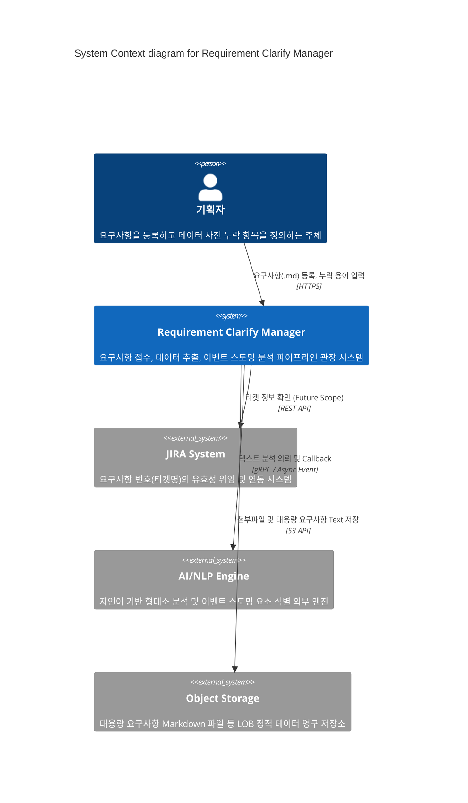
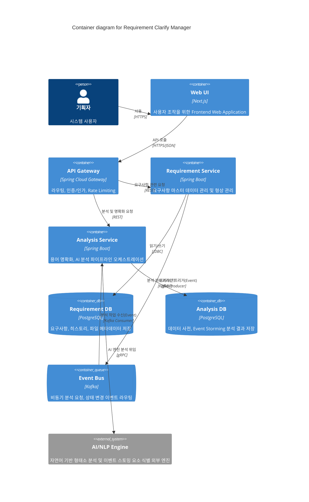

# 시스템 아키텍처

## 1. C4 Model - Context Diagram
요구사항 명세 관리 시스템(Requirement Clarify Manager)이 외부 액터 및 시스템과 어떻게 상호작용하는지 보여줍니다.

## 2. C4 Model - Container Diagram
내부 컨테이너 수준의 시스템 구성도입니다. MSA로 분리되어 동작합니다.

## 3. 레이어 아키텍처 (Layered Architecture)
각 개별 마이크로서비스는 **Hexagonal Architecture (Ports and Adapters)** 패턴을 따릅니다.
- **Presentation Layer (Inbound Adapter)**: REST Controller, Event Listener (Kafka Consumer)
- **Application Layer (Use Case)**: 비즈니스 흐름 오케스트레이션 수행. `@Transactional` 관리, 컴포넌트 간 조율.
- **Domain Layer**: 엔티티 생명주기 제어 및 핵심 비즈니스 로직(예: 버전 포맷 검증 규칙, 상태 전이 규칙) 캡슐화. 이 영역은 외부 의존성이 없어야 함.
- **Infrastructure Layer (Outbound Adapter)**: Spring Data JPA DB Query, 외부 AI Engine 연동 gRPC Client, S3 업로더 등 외부 시스템/저장소와의 연동.

## 4. 배포 아키텍처 (Deployment Architecture)
- **Orchestration**: Kubernetes(EKS) 클러스터 상에 컨테이너화 되어 배포.
- **Ingress**: AWS ALB Ingress Controller를 사용해 API Gateway로 트래픽 라우팅.
- **Scalability**: Web UI, API Gateway, Requirement/Analysis Service 모듈들 모두 HPA(Horizontal Pod Autoscaler) 설정으로 CPU/Memory 기반 오토 스케일링 구성.
- **비동기 처리**: AI 분석 작업의 지연을 대비하여 Analysis Service 워커 풀 격리 및 Kafka 파티션을 통한 분산 처리 적용.
